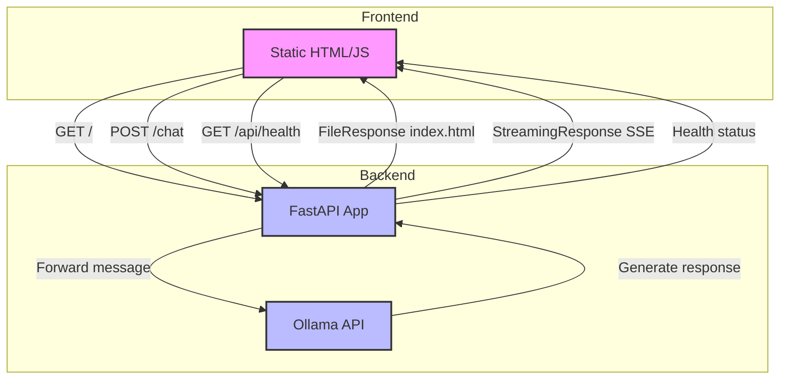

# Myra AI Assistant

Myra is a private AI assistant built using Ollama, FastAPI, and Tailwind CSS. It provides a chat interface for users to interact with an AI model.

## Technologies Used

- Backend: FastAPI
- Frontend: HTML, JavaScript, Tailwind CSS
- AI Model: Ollama (llama2)

## Setup

1. Install dependencies:
   ```
   pip install fastapi uvicorn httpx python-dotenv loguru
   ```

2. Install Ollama and run the llama2 model:
   ```
   # Follow Ollama installation instructions from https://ollama.ai/
   ollama run llama2
   ```

3. Run the FastAPI server:
   ```
   uvicorn src.voice_assistant.app:app --reload
   ```

4. Open a web browser and navigate to `http://localhost:8000` to interact with Myra.

## Project Structure

- `src/voice_assistant/app.py`: FastAPI backend
- `static/index.html`: Frontend HTML and JavaScript
- `README.md`: This file

## Features

- Chat interface with AI-powered responses
- Error handling and loading states
- Responsive design using Tailwind CSS
- Integration with Ollama for AI model processing
- FastAPI backend for efficient API handling
- CORS middleware for cross-origin requests
- Health check endpoint for monitoring

## Usage

1. Type your message in the input field at the bottom of the page.
2. Press "Send" or hit Enter to send your message.
3. Myra will process your message and provide a response.
4. The conversation history is displayed in the chat window.

## System Architecture

The application consists of a frontend (static HTML/JS) and a backend (FastAPI), with the following main components and flows:


### API Routes

1. `GET /`
   - Serves the main `index.html` file for the chat interface.
   - Response: `FileResponse`

2. `POST /chat`
   - Handles incoming chat messages.
   - Request Body: `{ "message": string }`
   - Response: `StreamingResponse` (Server-Sent Events)
     - Streams AI-generated responses back to the client.

3. `GET /api/health`
   - Performs a health check on the API.
   - Response: `{ "status": string, "message": string }`

### Request and Response Flow

1. Frontend loads:
   - Client requests the root URL (`/`).
   - Backend serves the `index.html` file.

2. User sends a chat message:
   - Frontend sends a POST request to `/chat` with the message.
   - Backend receives the message and forwards it to Ollama.
   - Ollama processes the message and generates a response.
   - Backend streams the response back to the frontend using Server-Sent Events.
   - Frontend displays the streamed response to the user.

3. Health check:
   - Client or monitoring service requests `/api/health`.
   - Backend responds with the current health status.

## Setup and Running

[Include instructions for setting up and running the application]

## Dependencies

- FastAPI
- Ollama
- httpx
- pydantic
- loguru

## Architecture Diagram

## System Architecture

The following diagram illustrates the system architecture, API routes, and request/response flow of the Myra AI Assistant:



```
+-------------------+        +-------------------+
|     Frontend      |        |      Backend      |
| (Static HTML/JS)  |        |    (FastAPI App)  |
+-------------------+        +-------------------+
         |                             |
         |                             |
         |  GET /                      |
         | ------------------------>   |
         |                             |
         |  FileResponse(index.html)   |
         | <------------------------   |
         |                             |
         |                             |
         |  POST /chat                 |
         |  {message: string}          |
         | ------------------------>   |
         |                             |
         |                             |
         |                     +----------------+
         |                     |  Ollama API    |
         |                     |  (LLM Service) |
         |                     +----------------+
         |                             |
         |                             |
         |  StreamingResponse          |
         |  (Server-Sent Events)       |
         | <------------------------   |
         |                             |
         |                             |
         |  GET /api/health            |
         | ------------------------>   |
         |                             |
         |  {status: string,           |
         |   message: string}          |
         | <------------------------   |
         |                             |
```

## Note

This is a development version and should not be used in production without proper security measures and optimizations.
